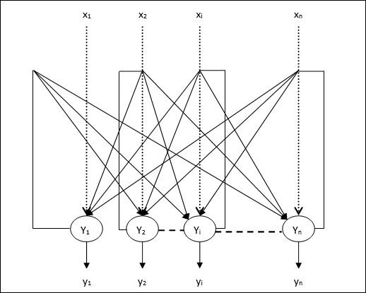

# Introduction
A Hopfield network is a form of recurrent artificial neural networkHopfield networks serve as content-addressable ("associative") memory systems with binary threshold nodes.



# Code:
The network is trained with these two patterns, and any patters that the users gives will be associated to one of these patterns.

```python
p1=np.array([[1,-1]
             ,[-1,-1]
             ,[1,-1]])
```
You can run this code from your terminal/prompt/shell with typing

```python
python hop.py
```
